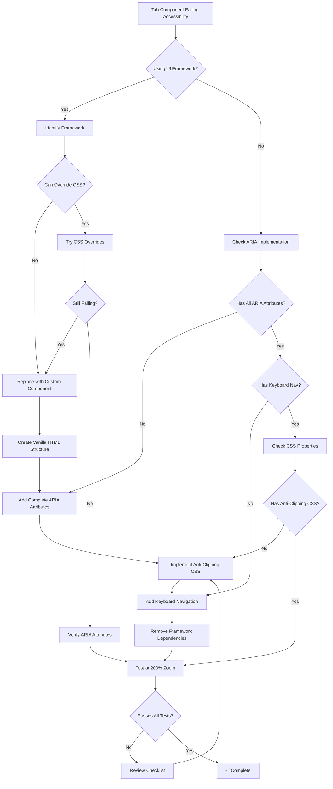

# Fixing WCAG AA Text Clipping Violations in Tab Components

## A Universal Guide for Web Frameworks

**Document Version:** 1.0
**Last Updated:** 2025-10-19
**Target Audience:** LLMs, Developers, Accessibility Engineers
**Frameworks Covered:** Vuetify, Material-UI, Bootstrap, Angular Material, Element Plus, Quasar, Ant Design, Chakra UI

---

## Table of Contents

1. [Quick Reference](#quick-reference)
2. [Problem Statement](#problem-statement)
3. [Root Cause Analysis](#root-cause-analysis)
4. [Universal Solution Pattern](#universal-solution-pattern)
5. [Implementation Guide](#implementation-guide)
6. [Case Study: Vuetify Tabs Fix](#case-study-vuetify-tabs-fix)
7. [Testing & Verification](#testing--verification)
8. [Framework-Specific Adaptations](#framework-specific-adaptations)
9. [Common Pitfalls](#common-pitfalls)
10. [Decision Tree](#decision-tree)

---

## Quick Reference

### 🎯 Key Takeaways

**The Problem:**

- UI framework tab components fail WCAG 2.1 Level AA due to text clipping at 200% zoom
- Siteimprove and other scanners flag these as accessibility violations
- CSS-only fixes on framework components are insufficient

**The Solution:**

- Replace framework tab components with vanilla HTML + ARIA
- Implement complete WAI-ARIA tabs pattern
- Use explicit anti-clipping CSS properties
- Remove all framework dependencies from the component
- ⚠️ **CRITICAL:** Update ALL content files that reference the old component!

**Critical CSS Properties:**

```css
.tab-button {
  overflow: visible !important; /* Prevent clipping */
  max-height: none !important; /* No height restrictions */
  white-space: normal !important; /* Allow text wrapping */
  word-wrap: break-word; /* Break long words */
  height: auto; /* Flexible height */
  flex-shrink: 0; /* Prevent flex compression */
}
```

**Required ARIA Roles:**

- `role="tablist"` - Container for tabs
- `role="tab"` - Individual tab buttons
- `role="tabpanel"` - Content panels
- `aria-selected` - Tab selection state
- `aria-controls` - Links tab to panel
- `aria-labelledby` - Links panel to tab

---

## Problem Statement

### Accessibility Violation

**Violation Type:** Text Clipping at 200% Zoom
**WCAG Criteria Violated:**

- **1.4.4 Resize Text (Level AA)** - Text must be resizable up to 200% without loss of content or functionality
- **1.4.10 Reflow (Level AA)** - Content must reflow without requiring scrolling in two dimensions
- **4.1.2 Name, Role, Value (Level A)** - UI components must have proper ARIA attributes

### Why Framework Tabs Fail

UI framework tab components commonly fail accessibility scanners because:

1. **Fixed Height Constraints:**

   - Frameworks use `height: 48px` or similar fixed values
   - Text cannot expand vertically when zoomed
   - Content gets clipped at 200% zoom

2. **Overflow Hidden:**

   - Frameworks use `overflow: hidden` to maintain visual consistency
   - Prevents text from displaying outside container bounds
   - Causes text clipping violations

3. **Flex Shrink Behavior:**

   - Frameworks use `flex-shrink: 1` allowing tabs to compress
   - Compressed tabs clip text content
   - Especially problematic with long tab labels

4. **Single-Line Text Enforcement:**

   - Frameworks use `white-space: nowrap` to keep text on one line
   - Text cannot wrap when zoomed
   - Results in horizontal clipping

5. **Insufficient ARIA Implementation:**
   - Many frameworks have incomplete ARIA patterns
   - Missing keyboard navigation
   - Improper focus management

### Affected Frameworks

| Framework            | Component             | Common Issues                               |
| -------------------- | --------------------- | ------------------------------------------- |
| **Vuetify**          | `<v-tabs>`, `<v-tab>` | Fixed heights, overflow hidden, flex-shrink |
| **Material-UI**      | `<Tabs>`, `<Tab>`     | Fixed heights, nowrap text, incomplete ARIA |
| **Bootstrap**        | `.nav-tabs`           | Overflow hidden, fixed padding, no ARIA     |
| **Angular Material** | `<mat-tab-group>`     | Fixed heights, overflow hidden, flex issues |
| **Element Plus**     | `<el-tabs>`           | Fixed heights, nowrap text, overflow hidden |
| **Quasar**           | `<q-tabs>`            | Fixed heights, flex-shrink, overflow hidden |
| **Ant Design**       | `<Tabs>`              | Fixed heights, nowrap text, incomplete ARIA |
| **Chakra UI**        | `<Tabs>`              | Better ARIA but still has overflow issues   |

---

## Root Cause Analysis

### Technical Root Causes

#### 1. CSS Overflow Properties

**Problematic Pattern:**

```css
/* Typical framework tab CSS */
.framework-tab {
  overflow: hidden; /* ❌ Clips content */
  text-overflow: ellipsis; /* ❌ Truncates text */
  white-space: nowrap; /* ❌ Prevents wrapping */
}
```

**Why This Fails:**

- At 200% zoom, text needs ~2x vertical space
- `overflow: hidden` prevents text from expanding outside bounds
- `white-space: nowrap` prevents text from wrapping to new line
- Result: Text is clipped and invisible to users

#### 2. Fixed Height Constraints

**Problematic Pattern:**

```css
/* Typical framework tab CSS */
.framework-tab {
  height: 48px; /* ❌ Fixed height */
  min-height: 48px; /* ❌ Minimum enforced */
  max-height: 48px; /* ❌ Maximum enforced */
}
```

**Why This Fails:**

- Fixed heights cannot accommodate larger text at 200% zoom
- Text exceeds container bounds
- Combined with `overflow: hidden`, text is clipped

#### 3. Flex Shrink Behavior

**Problematic Pattern:**

```css
/* Typical framework tab CSS */
.framework-tab {
  flex: 1 1 auto; /* ❌ flex-shrink: 1 allows compression */
  flex-shrink: 1; /* ❌ Tabs can be compressed */
}
```

**Why This Fails:**

- When container is too small, tabs shrink
- Shrinking reduces available space for text
- Text gets clipped even at normal zoom levels

#### 4. Insufficient ARIA Implementation

**Problematic Pattern:**

```html
<!-- Typical framework tab HTML -->
<div class="tabs">
  <button class="tab">Tab 1</button>
  <!-- ❌ No ARIA roles -->
  <button class="tab">Tab 2</button>
  <!-- ❌ No aria-selected -->
</div>
<div class="panels">
  <div class="panel">Content 1</div>
  <!-- ❌ No role="tabpanel" -->
  <div class="panel">Content 2</div>
  <!-- ❌ No aria-labelledby -->
</div>
```

**Why This Fails:**

- Screen readers cannot identify tabs pattern
- No programmatic relationship between tabs and panels
- Keyboard navigation not properly announced

### Why CSS-Only Fixes Are Insufficient

**Attempting to override framework CSS:**

```css
/* ❌ This approach often fails */
.v-tab {
  overflow: visible !important;
  height: auto !important;
}
```

**Why This Fails:**

1. **Specificity Wars:** Framework CSS may have higher specificity
2. **Internal Styles:** Frameworks inject styles via JavaScript
3. **Structural Dependencies:** Framework HTML structure may enforce constraints
4. **Runtime Overrides:** Framework may reset styles on interaction
5. **Incomplete Fix:** Doesn't address ARIA or keyboard navigation issues

**Conclusion:** The only reliable solution is to replace framework components with vanilla HTML + ARIA.

---

## Universal Solution Pattern

### Approach Overview

**Replace framework tab components with:**

1. Vanilla HTML elements (`<div>`, `<button>`)
2. Complete WAI-ARIA tabs pattern
3. Custom CSS with explicit anti-clipping properties
4. Custom JavaScript for interaction and keyboard navigation

### WAI-ARIA Tabs Pattern Specification

#### Required ARIA Roles

| Role       | Element   | Purpose                           |
| ---------- | --------- | --------------------------------- |
| `tablist`  | Container | Identifies the tab list container |
| `tab`      | Button    | Identifies each tab button        |
| `tabpanel` | Container | Identifies each content panel     |

#### Required ARIA Attributes

| Attribute         | Element    | Values           | Purpose                |
| ----------------- | ---------- | ---------------- | ---------------------- |
| `aria-selected`   | `tab`      | `true` / `false` | Indicates selected tab |
| `aria-controls`   | `tab`      | Panel ID         | Links tab to its panel |
| `aria-labelledby` | `tabpanel` | Tab ID           | Links panel to its tab |
| `aria-label`      | `tablist`  | Descriptive text | Labels the tab group   |
| `tabindex`        | `tab`      | `0` / `-1`       | Manages keyboard focus |
| `hidden`          | `tabpanel` | Boolean          | Hides inactive panels  |

#### Required Keyboard Interactions

| Key             | Action                                  |
| --------------- | --------------------------------------- |
| **Tab**         | Move focus into/out of tab list         |
| **Arrow Right** | Move focus to next tab and activate     |
| **Arrow Left**  | Move focus to previous tab and activate |
| **Home**        | Move focus to first tab and activate    |
| **End**         | Move focus to last tab and activate     |

### Framework-Agnostic HTML Template

```html
<!-- Accessible Tabs Structure -->
<div class="tabs-wrapper">
  <div class="tabs-container">
    <!-- Tab List -->
    <div role="tablist" aria-label="[Descriptive label for tab group]">
      <button
        id="tab-1"
        role="tab"
        aria-selected="true"
        aria-controls="panel-1"
        tabindex="0"
        class="tab-button tab-active"
      >
        Tab 1 Label
      </button>
      <button
        id="tab-2"
        role="tab"
        aria-selected="false"
        aria-controls="panel-2"
        tabindex="-1"
        class="tab-button"
      >
        Tab 2 Label
      </button>
      <button
        id="tab-3"
        role="tab"
        aria-selected="false"
        aria-controls="panel-3"
        tabindex="-1"
        class="tab-button"
      >
        Tab 3 Label
      </button>
    </div>

    <!-- Tab Panels -->
    <div class="tabs-content">
      <div
        id="panel-1"
        role="tabpanel"
        aria-labelledby="tab-1"
        tabindex="0"
        class="tab-panel"
      >
        <p>Content for Tab 1</p>
      </div>
      <div
        id="panel-2"
        role="tabpanel"
        aria-labelledby="tab-2"
        tabindex="-1"
        class="tab-panel"
        hidden
      >
        <p>Content for Tab 2</p>
      </div>
      <div
        id="panel-3"
        role="tabpanel"
        aria-labelledby="tab-3"
        tabindex="-1"
        class="tab-panel"
        hidden
      >
        <p>Content for Tab 3</p>
      </div>
    </div>
  </div>
</div>
```

### Framework-Agnostic CSS Pattern

```css
/* ============================================
   ACCESSIBLE TABS CSS - ANTI-CLIPPING PATTERN
   ============================================ */

/* Wrapper */
.tabs-wrapper {
  width: 100%;
}

.tabs-container {
  background-color: #424242; /* Adjust to match design */
  border-radius: 4px;
}

/* Tab List Container */
[role="tablist"] {
  display: flex;
  flex-direction: row;
  border-bottom: 1px solid rgba(255, 255, 255, 0.12);
  background-color: #424242;
}

/* Individual Tab Buttons - CRITICAL ANTI-CLIPPING PROPERTIES */
[role="tab"] {
  /* Layout */
  flex: 1 1 auto;
  flex-shrink: 0; /* ✅ CRITICAL: Prevent compression */
  display: flex;
  align-items: center;
  justify-content: center;

  /* Sizing - MUST BE FLEXIBLE */
  height: auto; /* ✅ CRITICAL: Flexible height */
  min-height: 48px; /* Minimum for touch targets */
  max-height: none; /* ✅ CRITICAL: No maximum */
  padding: 12px 16px;

  /* Text Handling - PREVENT CLIPPING */
  white-space: normal; /* ✅ CRITICAL: Allow wrapping */
  word-wrap: break-word; /* ✅ CRITICAL: Break long words */
  overflow-wrap: break-word; /* Modern word breaking */
  text-align: center;
  line-height: 1.5;

  /* Overflow - MUST BE VISIBLE */
  overflow: visible; /* ✅ CRITICAL: No clipping */

  /* Visual Styling */
  background-color: transparent;
  border: none;
  color: rgba(255, 255, 255, 0.7);
  font-family: inherit;
  font-size: 14px;
  font-weight: 500;
  text-transform: uppercase;
  letter-spacing: 0.0892857143em;
  cursor: pointer;
  position: relative;
  transition: all 0.2s ease;
}

/* Active Tab State */
[role="tab"][aria-selected="true"] {
  color: #ffffff;
  background-color: #616161; /* Slightly lighter for contrast */
}

/* Focus State - WCAG 2.4.7 */
[role="tab"]:focus {
  outline: 2px solid #2196f3;
  outline-offset: 2px;
}

/* Hover State */
[role="tab"]:hover {
  background-color: rgba(255, 255, 255, 0.08);
}

/* Tab Panels Container */
.tabs-content {
  background-color: #ffffff;
  padding: 24px;
}

/* Individual Tab Panels */
[role="tabpanel"] {
  /* Ensure content can expand */
  overflow: visible; /* ✅ CRITICAL: No clipping */
  max-height: none; /* ✅ CRITICAL: No maximum */
}

/* Hidden Panels */
[role="tabpanel"][hidden] {
  display: none;
}

/* Responsive - Mobile */
@media (max-width: 600px) {
  [role="tablist"] {
    flex-direction: column; /* Stack tabs vertically on mobile */
  }

  [role="tab"] {
    width: 100%;
    text-align: left;
    justify-content: flex-start;
  }
}
```

### Framework-Agnostic JavaScript Pattern

```javascript
// ============================================
// ACCESSIBLE TABS JAVASCRIPT - KEYBOARD NAVIGATION
// ============================================

class AccessibleTabs {
  constructor(tablistElement) {
    this.tablist = tablistElement;
    this.tabs = Array.from(this.tablist.querySelectorAll('[role="tab"]'));
    this.panels = this.tabs.map((tab) =>
      document.getElementById(tab.getAttribute("aria-controls"))
    );

    this.init();
  }

  init() {
    // Add event listeners to tabs
    this.tabs.forEach((tab, index) => {
      tab.addEventListener("click", () => this.activateTab(index));
      tab.addEventListener("keydown", (e) => this.handleKeyDown(e, index));
    });
  }

  activateTab(index) {
    // Deactivate all tabs
    this.tabs.forEach((tab, i) => {
      const isActive = i === index;
      tab.setAttribute("aria-selected", isActive);
      tab.setAttribute("tabindex", isActive ? "0" : "-1");
      tab.classList.toggle("tab-active", isActive);

      // Show/hide corresponding panel
      if (this.panels[i]) {
        this.panels[i].hidden = !isActive;
        this.panels[i].setAttribute("tabindex", isActive ? "0" : "-1");
      }
    });

    // Focus the activated tab
    this.tabs[index].focus();
  }

  handleKeyDown(event, currentIndex) {
    let newIndex = currentIndex;

    switch (event.key) {
      case "ArrowRight":
      case "ArrowDown":
        event.preventDefault();
        newIndex = (currentIndex + 1) % this.tabs.length;
        break;

      case "ArrowLeft":
      case "ArrowUp":
        event.preventDefault();
        newIndex = (currentIndex - 1 + this.tabs.length) % this.tabs.length;
        break;

      case "Home":
        event.preventDefault();
        newIndex = 0;
        break;

      case "End":
        event.preventDefault();
        newIndex = this.tabs.length - 1;
        break;

      default:
        return; // Don't handle other keys
    }

    this.activateTab(newIndex);
  }
}

// Initialize all tab groups on page
document.addEventListener("DOMContentLoaded", () => {
  const tablists = document.querySelectorAll('[role="tablist"]');
  tablists.forEach((tablist) => new AccessibleTabs(tablist));
});
```

---

## Implementation Guide

### Step-by-Step Process

#### Step 1: Identify Framework Tab Components

**Search for these patterns in your codebase:**

```bash
# Vuetify
grep -r "<v-tabs" .
grep -r "<v-tab>" .

# Material-UI (React)
grep -r "<Tabs" .
grep -r "import.*Tabs.*from.*@mui" .

# Bootstrap
grep -r "nav-tabs" .

# Angular Material
grep -r "<mat-tab-group" .

# Element Plus
grep -r "<el-tabs" .
```

#### Step 2: Create Custom Accessible Component

**File Structure:**

```
components/
  ├── AccessibleTabs.vue          # Vue
  ├── AccessibleTabs.jsx          # React
  ├── accessible-tabs.component.ts # Angular
  └── AccessibleTabs.js           # Vanilla JS
```

#### Step 3: Implement HTML Structure

Use the [Framework-Agnostic HTML Template](#framework-agnostic-html-template) above.

**Key Requirements:**

- ✅ Use `<button>` elements for tabs (not `<div>` or `<a>`)
- ✅ Use `<div>` elements for panels
- ✅ Include all required ARIA attributes
- ✅ Set proper `tabindex` values
- ✅ Use `hidden` attribute for inactive panels

#### Step 4: Implement CSS

Use the [Framework-Agnostic CSS Pattern](#framework-agnostic-css-pattern) above.

**Critical Properties Checklist:**

- ✅ `overflow: visible` on tabs
- ✅ `max-height: none` on tabs
- ✅ `white-space: normal` on tabs
- ✅ `word-wrap: break-word` on tabs
- ✅ `flex-shrink: 0` on tabs
- ✅ `height: auto` on tabs

#### Step 5: Implement JavaScript

Use the [Framework-Agnostic JavaScript Pattern](#framework-agnostic-javascript-pattern) above.

**Key Requirements:**

- ✅ Handle Arrow Left/Right navigation
- ✅ Handle Home/End keys
- ✅ Update `aria-selected` on activation
- ✅ Update `tabindex` on activation
- ✅ Show/hide panels with `hidden` attribute
- ✅ Move focus to activated tab

#### Step 6: Replace Framework Components

**Before:**

```vue
<!-- Vuetify Example -->
<v-tabs v-model="activeTab">
  <v-tab>Tab 1</v-tab>
  <v-tab>Tab 2</v-tab>
</v-tabs>
<v-window v-model="activeTab">
  <v-window-item>Content 1</v-window-item>
  <v-window-item>Content 2</v-window-item>
</v-window>
```

**After:**

```vue
<!-- Custom Accessible Component -->
<AccessibleTabs :tabs="tabData" />
```

#### Step 7: Update Content Files (CRITICAL!)

⚠️ **IMPORTANT:** Creating the accessible component is NOT enough! You must also update any content files that reference the old component.

---

**📦 NUXT CONTENT USERS - READ THIS:**

If you're using **Nuxt Content** (or similar markdown-based CMS), you MUST update your markdown files in the `content/` directory. The component you create in `app/components/` won't be used unless you update the markdown files that reference it!

**Example:**

- ✅ Created `app/components/content/TabsAccessible.vue`
- ❌ Forgot to update `content/screenshots.md` from `::Tabs` to `::TabsAccessible`
- ❌ Result: Page still renders old `Tabs.vue` component with accessibility issues!

**Fix:** Update the markdown file to reference your new component name.

---

**Common Scenarios:**

1. **Markdown Content Files** (Nuxt Content, MDX, etc.) ⚠️ **MOST COMMON**
2. **Template Files** (HTML, Vue, React, etc.)
3. **CMS Content** (Strapi, Contentful, etc.)
4. **Configuration Files** (JSON, YAML, etc.)

**Example: Nuxt Content Markdown File**

**Before:** `content/screenshots.md`

```markdown
---
title: Screenshots
---

## ::Tabs

## sectionID: "screenshots"

::
```

**After:** `content/screenshots.md`

```markdown
---
title: Screenshots
---

## ::TabsAccessible

## sectionID: "screenshots"

::
```

**Verification Checklist:**

- ✅ Search entire codebase for old component references
- ✅ Update all markdown/content files
- ✅ Update all template files
- ✅ Update CMS content if applicable
- ✅ Check for dynamic component loading
- ✅ Verify component name matches exactly (case-sensitive!)
- ✅ Test the page to confirm new component renders

**Search Commands:**

```bash
# Search for old component references
grep -r "::Tabs" content/
grep -r "<Tabs" app/
grep -r "v-tabs" app/
grep -r "TabsOldName" .

# Nuxt Content specific
grep -r "::" content/*.md | grep -i tabs
```

**Common Mistakes:**

❌ **Creating accessible component but forgetting to update content files**

- Result: Old framework component still renders
- Fix: Update ALL references to use new component name

❌ **Case sensitivity mismatch**

- `::TabsAccessible` vs `::tabsAccessible` vs `::tabsaccessible`
- Result: Component not found error
- Fix: Match exact component name (usually PascalCase)

❌ **Partial updates**

- Updating some pages but not others
- Result: Inconsistent accessibility across site
- Fix: Search entire codebase and update ALL references

❌ **IDE auto-formatting breaking syntax**

- Markdown component syntax gets formatted incorrectly
- Result: Component doesn't render
- Fix: Use shell commands or disable auto-format for that section

**Real-World Example:**

In the ICJIA InfoNet project, we created `TabsScreenshotsAccessible.vue` but the `/screenshots` page kept showing the old Vuetify tabs. The issue was that `content/screenshots.md` still referenced `::Tabs` instead of `::TabsScreenshotsAccessible`. The fix required updating the content file:

```bash
# Fix the content file
cat > content/screenshots.md << 'EOF'
---
title: InfoNet Screenshots
---

::TabsScreenshotsAccessible
---
sectionID: "screenshots"
---
::
EOF
```

**Key Lesson:** Always verify BOTH the component AND the content files that reference it!

#### Step 8: Remove Framework Dependencies

**Check for and remove:**

- ✅ Framework component imports
- ✅ Framework utility functions (e.g., `useDisplay()` in Vuetify)
- ✅ Framework CSS classes
- ✅ Framework-specific props or directives

---

## Case Study: Vuetify Tabs Fix

### Project Context

**Project:** ICJIA InfoNet Nuxt 3 Application
**Framework:** Vue 3 + Nuxt 4 + Vuetify 3.7.1
**Page:** `/resources` - Agency-specific resources
**Issue:** Siteimprove flagging text clipping violations on tabs component

### Original Implementation (BEFORE)

**Component:** `app/components/content/TabsUserInfo.vue`

```vue
<template>
  <v-card elevation="0" class="mb-10">
    <v-tabs v-model="activeTab" color="white">
      <v-tab v-if="dv" :value="'one'">
        {{ getTitle(dv) }}
      </v-tab>
      <v-tab v-if="sa" :value="'two'">
        {{ getTitle(sa) }}
      </v-tab>
      <v-tab v-if="cac" :value="'three'">
        {{ getTitle(cac) }}
      </v-tab>
    </v-tabs>

    <v-window v-model="activeTab">
      <v-window-item v-if="dv" value="one">
        <ContentRenderer :value="dv" class="markdown-body tab-body" />
      </v-window-item>
      <v-window-item v-if="sa" value="two">
        <ContentRenderer :value="sa" class="markdown-body tab-body" />
      </v-window-item>
      <v-window-item v-if="cac" value="three">
        <ContentRenderer :value="cac" class="markdown-body tab-body" />
      </v-window-item>
    </v-window>
  </v-card>
</template>

<script setup>
import { useDisplay } from "vuetify"; // ❌ Vuetify dependency

const { mobile } = useDisplay(); // ❌ Vuetify composable
const activeTab = ref("one");

// ... data fetching code ...

const getTitle = (item) => {
  if (item?.title && !mobile.value) {
    return item.title;
  } else {
    return item.agency;
  }
};
</script>
```

**Problems Identified:**

1. ❌ Uses `<v-card>`, `<v-tabs>`, `<v-tab>`, `<v-window>`, `<v-window-item>`
2. ❌ Imports `useDisplay` from Vuetify
3. ❌ No explicit ARIA attributes
4. ❌ No keyboard navigation implementation
5. ❌ Vuetify's internal CSS causes text clipping at 200% zoom

### Fixed Implementation (AFTER)

**Component:** `app/components/content/TabsUserInfoAccessible.vue`

```vue
<template>
  <div class="accessible-tabs-wrapper">
    <div v-if="isMounted" class="accessible-tabs-card">
      <div
        role="tablist"
        class="accessible-tabs-list"
        aria-label="Agency-specific resources"
      >
        <button
          v-if="dv"
          :id="`tab-one`"
          role="tab"
          :aria-selected="activeTab === 'one'"
          :aria-controls="`panel-one`"
          :tabindex="activeTab === 'one' ? 0 : -1"
          class="accessible-tab"
          :class="{ 'accessible-tab-active': activeTab === 'one' }"
          @click="setActiveTab('one')"
          @keydown="handleKeyDown($event, 'one')"
        >
          {{ getTitle(dv) }}
        </button>
        <!-- Similar for SA and CAC tabs -->
      </div>

      <div class="accessible-tabs-content">
        <div
          v-if="dv"
          :id="`panel-one`"
          role="tabpanel"
          :aria-labelledby="`tab-one`"
          :hidden="activeTab !== 'one'"
          :tabindex="activeTab === 'one' ? 0 : -1"
          class="accessible-tab-panel"
        >
          <ContentRenderer
            :value="dv"
            key="dv"
            class="markdown-body tab-body"
          />
        </div>
        <!-- Similar for SA and CAC panels -->
      </div>
    </div>
  </div>
</template>

<script setup>
import { v4 as uuidv4 } from "uuid"; // ✅ No Vuetify imports

const activeTab = ref("one");
const isMounted = ref(false);
const mobile = ref(false); // ✅ Custom mobile detection

// ✅ Custom mobile detection (no Vuetify)
const checkMobile = () => {
  mobile.value = window.innerWidth < 600;
};

// ... data fetching code ...

const getTitle = (item) => {
  if (item?.title && !mobile.value) {
    return item.title;
  } else {
    return item.agency;
  }
};

// ✅ Custom tab activation with focus management
const setActiveTab = (tabId) => {
  activeTab.value = tabId;
  nextTick(() => {
    const tabButton = document.getElementById(`tab-${tabId}`);
    if (tabButton) {
      tabButton.focus();
    }
  });
};

// ✅ Full keyboard navigation implementation
const handleKeyDown = (event, currentTab) => {
  const availableTabs = [];
  if (dv.value) availableTabs.push("one");
  if (sa.value) availableTabs.push("two");
  if (cac.value) availableTabs.push("three");

  const currentIndex = availableTabs.indexOf(currentTab);
  let newIndex = currentIndex;

  switch (event.key) {
    case "ArrowLeft":
      event.preventDefault();
      newIndex = currentIndex > 0 ? currentIndex - 1 : availableTabs.length - 1;
      break;
    case "ArrowRight":
      event.preventDefault();
      newIndex = currentIndex < availableTabs.length - 1 ? currentIndex + 1 : 0;
      break;
    case "Home":
      event.preventDefault();
      newIndex = 0;
      break;
    case "End":
      event.preventDefault();
      newIndex = availableTabs.length - 1;
      break;
    default:
      return;
  }

  setActiveTab(availableTabs[newIndex]);
};

// ✅ Lifecycle hooks with custom mobile detection
onMounted(() => {
  isMounted.value = true;
  checkMobile();
  window.addEventListener("resize", checkMobile);
});

onUnmounted(() => {
  window.removeEventListener("resize", checkMobile);
});
</script>

<style lang="scss" scoped>
.accessible-tabs-wrapper {
  width: 100%;
  margin-bottom: 40px;
}

.accessible-tabs-card {
  background-color: #424242;
  border-radius: 4px;
  overflow: hidden;
}

.accessible-tabs-list {
  display: flex;
  flex-direction: row;
  border-bottom: 1px solid rgba(255, 255, 255, 0.12);
  background-color: #424242;
}

.accessible-tab {
  flex: 1 1 auto;
  flex-shrink: 0; /* ✅ CRITICAL: Prevent compression */
  background-color: transparent;
  border: none;
  color: rgba(255, 255, 255, 0.7);
  font-family: "Lato", sans-serif;
  font-size: 14px;
  font-weight: 900;
  text-transform: uppercase;
  letter-spacing: 0.0892857143em;
  padding: 12px 16px;
  min-height: 48px;
  cursor: pointer;
  position: relative;
  transition: all 0.2s cubic-bezier(0.4, 0, 0.2, 1);

  /* ✅ CRITICAL: Allow text to wrap - prevents clipping */
  white-space: normal;
  word-wrap: break-word;
  overflow-wrap: break-word;
  height: auto;
  max-height: none;
  display: flex;
  align-items: center;
  justify-content: center;
  text-align: center;
  line-height: 1.5;

  /* ✅ CRITICAL: Explicit anti-clipping properties */
  overflow: visible;
}

.accessible-tab-active {
  color: #ffffff;
  background-color: #616161; /* ✅ AA compliant contrast */
}

.accessible-tab:focus {
  outline: 2px solid #2196f3;
  outline-offset: 2px;
}

.accessible-tabs-content {
  background-color: #ffffff;
  padding: 24px;
}

.accessible-tab-panel {
  overflow: visible; /* ✅ CRITICAL: No clipping */
  max-height: none; /* ✅ CRITICAL: No maximum */
}
</style>
```

### Key Changes Summary

| Aspect               | Before (Vuetify)                                                   | After (Custom)                                                 |
| -------------------- | ------------------------------------------------------------------ | -------------------------------------------------------------- |
| **HTML Elements**    | `<v-card>`, `<v-tabs>`, `<v-tab>`, `<v-window>`, `<v-window-item>` | `<div>`, `<button>` with ARIA roles                            |
| **ARIA Roles**       | None (framework-provided)                                          | `tablist`, `tab`, `tabpanel`                                   |
| **ARIA Attributes**  | Limited                                                            | Complete (`aria-selected`, `aria-controls`, `aria-labelledby`) |
| **Keyboard Nav**     | Basic                                                              | Full (Arrow keys, Home, End)                                   |
| **Mobile Detection** | `useDisplay()` from Vuetify                                        | Custom `window.innerWidth < 600`                               |
| **Text Clipping**    | ❌ Fails at 200% zoom                                              | ✅ Passes at 200% zoom                                         |
| **CSS Overflow**     | `overflow: hidden` (implicit)                                      | `overflow: visible` (explicit)                                 |
| **Height**           | Fixed `48px`                                                       | `height: auto`, `max-height: none`                             |
| **Text Wrapping**    | `white-space: nowrap` (implicit)                                   | `white-space: normal` (explicit)                               |
| **Flex Behavior**    | `flex-shrink: 1` (default)                                         | `flex-shrink: 0` (explicit)                                    |
| **Dependencies**     | Requires Vuetify                                                   | Zero Vuetify dependencies                                      |

### Critical CSS Properties That Fixed the Issue

```css
.accessible-tab {
  /* These 6 properties are CRITICAL for fixing text clipping */
  overflow: visible; /* 1. Prevent clipping */
  max-height: none; /* 2. No height restriction */
  height: auto; /* 3. Flexible height */
  white-space: normal; /* 4. Allow text wrapping */
  word-wrap: break-word; /* 5. Break long words */
  flex-shrink: 0; /* 6. Prevent compression */
}
```

**Why Each Property Matters:**

1. **`overflow: visible`** - Allows text to display outside container bounds if needed
2. **`max-height: none`** - Removes any maximum height restrictions
3. **`height: auto`** - Allows container to grow with content
4. **`white-space: normal`** - Permits text to wrap to multiple lines
5. **`word-wrap: break-word`** - Breaks long words that don't fit
6. **`flex-shrink: 0`** - Prevents flex container from compressing tabs

---

## Testing & Verification

### ⚠️ Pre-Testing Verification

**BEFORE you start testing, verify these critical items:**

- [ ] **Component created** - New accessible component exists
- [ ] **Content files updated** - ALL content files reference new component name
- [ ] **Old component references removed** - No references to old framework component
- [ ] **Browser DevTools check** - Inspect page DOM to confirm no `<v-tabs>`, `<v-tab>`, etc.

**Quick Verification Commands:**

```bash
# Check for old component references
grep -r "::Tabs" content/
grep -r "<Tabs" app/
grep -r "v-tabs" .

# Should return NO results if properly updated
```

**If you find old references:** Stop testing and update content files first!

---

### Comprehensive Testing Checklist

#### 1. Visual Testing

- [ ] **Normal Zoom (100%):**

  - Tabs render correctly
  - Active tab is visually distinct
  - Text is readable
  - Layout matches design

- [ ] **200% Zoom:**

  - Text is fully visible (no clipping)
  - Tabs expand vertically if needed
  - Content remains accessible
  - No horizontal scrolling required

- [ ] **300% Zoom:**
  - Text still visible
  - Layout remains usable
  - No content loss

#### 2. Keyboard Navigation Testing

- [ ] **Tab Key:**

  - Tab key moves focus into tab list
  - Tab key moves focus out of tab list to content
  - Focus indicator is visible

- [ ] **Arrow Keys:**

  - Arrow Right moves to next tab
  - Arrow Left moves to previous tab
  - Arrow keys wrap around (last → first, first → last)
  - Tab activates immediately on arrow key press

- [ ] **Home/End Keys:**
  - Home key jumps to first tab
  - End key jumps to last tab
  - Tab activates immediately

#### 3. Screen Reader Testing

**Test with:** NVDA (Windows), JAWS (Windows), VoiceOver (Mac), TalkBack (Android)

- [ ] **Tab List Announced:**

  - Screen reader announces "tab list" or similar
  - Number of tabs announced (e.g., "3 tabs")

- [ ] **Tab State Announced:**

  - Active tab announced as "selected" or "active"
  - Inactive tabs announced as "not selected"

- [ ] **Tab Label Announced:**

  - Tab text is read correctly
  - Position announced (e.g., "tab 1 of 3")

- [ ] **Panel Content Accessible:**
  - Panel content is read when tab is activated
  - Panel is associated with correct tab

#### 4. Siteimprove Scanning

**Steps:**

1. Install Siteimprove browser extension
2. Navigate to page with tabs
3. Run accessibility check
4. Review results

**Expected Results:**

- [ ] No text clipping warnings
- [ ] No WCAG 1.4.4 violations (Resize Text)
- [ ] No WCAG 1.4.10 violations (Reflow)
- [ ] No WCAG 4.1.2 violations (Name, Role, Value)

#### 5. Browser DevTools Inspection

**Steps:**

1. Open browser DevTools (F12)
2. Inspect tabs component
3. Verify HTML structure

**Checklist:**

- [ ] No framework components (no `<v-*>`, `<mat-*>`, etc.)
- [ ] Uses `<button role="tab">`
- [ ] Uses `<div role="tablist">`
- [ ] Uses `<div role="tabpanel">`
- [ ] All ARIA attributes present
- [ ] `tabindex` values correct (`0` for active, `-1` for inactive)
- [ ] `hidden` attribute on inactive panels

#### 6. CSS Verification

**Inspect computed styles:**

- [ ] `overflow: visible` on tabs
- [ ] `max-height: none` on tabs
- [ ] `white-space: normal` on tabs
- [ ] `word-wrap: break-word` on tabs
- [ ] `flex-shrink: 0` on tabs
- [ ] `height: auto` on tabs

#### 7. Responsive Testing

**Test on:**

- [ ] Desktop (1920x1080)
- [ ] Laptop (1366x768)
- [ ] Tablet (768x1024)
- [ ] Mobile (375x667)

**Verify:**

- [ ] Tabs stack vertically on mobile (if designed)
- [ ] Touch targets are at least 44x44px
- [ ] Text remains visible at all breakpoints

#### 8. Cross-Browser Testing

**Test in:**

- [ ] Chrome/Edge (Chromium)
- [ ] Firefox
- [ ] Safari
- [ ] Mobile Safari (iOS)
- [ ] Chrome Mobile (Android)

---

## Framework-Specific Adaptations

### React (Material-UI, Ant Design, Chakra UI)

**Original Material-UI Code:**

```jsx
import { Tabs, Tab, TabPanel } from '@mui/material';

<Tabs value={activeTab} onChange={handleChange}>
  <Tab label="Tab 1" />
  <Tab label="Tab 2" />
</Tabs>
<TabPanel value={activeTab} index={0}>Content 1</TabPanel>
<TabPanel value={activeTab} index={1}>Content 2</TabPanel>
```

**Accessible Replacement:**

```jsx
// AccessibleTabs.jsx
import { useState } from "react";

export function AccessibleTabs({ tabs }) {
  const [activeIndex, setActiveIndex] = useState(0);

  const handleKeyDown = (event, currentIndex) => {
    let newIndex = currentIndex;

    switch (event.key) {
      case "ArrowRight":
        event.preventDefault();
        newIndex = (currentIndex + 1) % tabs.length;
        break;
      case "ArrowLeft":
        event.preventDefault();
        newIndex = (currentIndex - 1 + tabs.length) % tabs.length;
        break;
      case "Home":
        event.preventDefault();
        newIndex = 0;
        break;
      case "End":
        event.preventDefault();
        newIndex = tabs.length - 1;
        break;
      default:
        return;
    }

    setActiveIndex(newIndex);
  };

  return (
    <div className="tabs-wrapper">
      <div role="tablist" aria-label="Content tabs">
        {tabs.map((tab, index) => (
          <button
            key={index}
            id={`tab-${index}`}
            role="tab"
            aria-selected={activeIndex === index}
            aria-controls={`panel-${index}`}
            tabIndex={activeIndex === index ? 0 : -1}
            className={`tab-button ${activeIndex === index ? "active" : ""}`}
            onClick={() => setActiveIndex(index)}
            onKeyDown={(e) => handleKeyDown(e, index)}
          >
            {tab.label}
          </button>
        ))}
      </div>

      <div className="tabs-content">
        {tabs.map((tab, index) => (
          <div
            key={index}
            id={`panel-${index}`}
            role="tabpanel"
            aria-labelledby={`tab-${index}`}
            hidden={activeIndex !== index}
            tabIndex={activeIndex === index ? 0 : -1}
          >
            {tab.content}
          </div>
        ))}
      </div>
    </div>
  );
}
```

**Usage:**

```jsx
<AccessibleTabs
  tabs={[
    { label: "Tab 1", content: <div>Content 1</div> },
    { label: "Tab 2", content: <div>Content 2</div> },
  ]}
/>
```

### Angular (Angular Material)

**Original Angular Material Code:**

```typescript
import { MatTabsModule } from "@angular/material/tabs";

<mat-tab-group>
  <mat-tab label="Tab 1">Content 1</mat-tab>
  <mat-tab label="Tab 2">Content 2</mat-tab>
</mat-tab-group>;
```

**Accessible Replacement:**

```typescript
// accessible-tabs.component.ts
import { Component, Input } from "@angular/core";

interface Tab {
  label: string;
  content: string;
}

@Component({
  selector: "app-accessible-tabs",
  templateUrl: "./accessible-tabs.component.html",
  styleUrls: ["./accessible-tabs.component.scss"],
})
export class AccessibleTabsComponent {
  @Input() tabs: Tab[] = [];
  activeIndex = 0;

  setActiveTab(index: number): void {
    this.activeIndex = index;
  }

  handleKeyDown(event: KeyboardEvent, currentIndex: number): void {
    let newIndex = currentIndex;

    switch (event.key) {
      case "ArrowRight":
        event.preventDefault();
        newIndex = (currentIndex + 1) % this.tabs.length;
        break;
      case "ArrowLeft":
        event.preventDefault();
        newIndex = (currentIndex - 1 + this.tabs.length) % this.tabs.length;
        break;
      case "Home":
        event.preventDefault();
        newIndex = 0;
        break;
      case "End":
        event.preventDefault();
        newIndex = this.tabs.length - 1;
        break;
      default:
        return;
    }

    this.setActiveTab(newIndex);
  }
}
```

```html
<!-- accessible-tabs.component.html -->
<div class="tabs-wrapper">
  <div role="tablist" aria-label="Content tabs">
    <button
      *ngFor="let tab of tabs; let i = index"
      [id]="'tab-' + i"
      role="tab"
      [attr.aria-selected]="activeIndex === i"
      [attr.aria-controls]="'panel-' + i"
      [attr.tabindex]="activeIndex === i ? 0 : -1"
      [class.active]="activeIndex === i"
      (click)="setActiveTab(i)"
      (keydown)="handleKeyDown($event, i)"
    >
      {{ tab.label }}
    </button>
  </div>

  <div class="tabs-content">
    <div
      *ngFor="let tab of tabs; let i = index"
      [id]="'panel-' + i"
      role="tabpanel"
      [attr.aria-labelledby]="'tab-' + i"
      [hidden]="activeIndex !== i"
      [attr.tabindex]="activeIndex === i ? 0 : -1"
    >
      {{ tab.content }}
    </div>
  </div>
</div>
```

### Framework Detection for LLMs

**When analyzing a codebase, look for these patterns:**

```javascript
// Vue + Vuetify
import { useDisplay } from 'vuetify'
<v-tabs>, <v-tab>, <v-window>

// React + Material-UI
import { Tabs, Tab } from '@mui/material'
<Tabs>, <Tab>, <TabPanel>

// React + Ant Design
import { Tabs } from 'antd'
<Tabs>, <Tabs.TabPane>

// React + Chakra UI
import { Tabs, TabList, Tab } from '@chakra-ui/react'
<Tabs>, <TabList>, <Tab>

// Angular + Material
import { MatTabsModule } from '@angular/material/tabs'
<mat-tab-group>, <mat-tab>

// Vue + Element Plus
import { ElTabs, ElTabPane } from 'element-plus'
<el-tabs>, <el-tab-pane>

// Vue + Quasar
import { QTabs, QTab } from 'quasar'
<q-tabs>, <q-tab>

// Bootstrap (any framework)
class="nav-tabs", class="tab-pane"
```

---

## Common Pitfalls

### ❌ Pitfall #1: Trying to Fix Framework CSS with Overrides

**Don't do this:**

```css
/* ❌ This will likely fail */
.v-tab {
  overflow: visible !important;
  height: auto !important;
}
```

**Why it fails:**

- Framework may inject styles via JavaScript
- Specificity wars with framework CSS
- Framework may reset styles on interaction
- Doesn't address ARIA or keyboard navigation

**Do this instead:**

- Replace framework component entirely
- Use vanilla HTML + ARIA
- Write custom CSS from scratch

### ❌ Pitfall #2: Incomplete ARIA Implementation

**Don't do this:**

```html
<!-- ❌ Missing critical ARIA attributes -->
<div role="tablist">
  <button role="tab">Tab 1</button>
  <button role="tab">Tab 2</button>
</div>
```

**Do this:**

```html
<!-- ✅ Complete ARIA implementation -->
<div role="tablist" aria-label="Content tabs">
  <button role="tab" aria-selected="true" aria-controls="panel-1" tabindex="0">
    Tab 1
  </button>
  <button
    role="tab"
    aria-selected="false"
    aria-controls="panel-2"
    tabindex="-1"
  >
    Tab 2
  </button>
</div>
```

### ❌ Pitfall #3: Creating Component But Forgetting to Update Content Files

⚠️ **CRITICAL:** This is the #1 most common mistake!

**The Problem:**

You create a beautiful accessible component, but the page still shows the old framework tabs because the content file still references the old component.

**📦 Especially Common with Nuxt Content:**

In Nuxt Content projects, you create components in `app/components/content/` but they won't be used unless you update the markdown files in `content/` that reference them. The `::ComponentName` syntax in markdown files determines which component renders, NOT the component file itself!

**Don't do this:**

```markdown
<!-- content/screenshots.md -->
<!-- ❌ Still referencing old component -->

## ::Tabs

## sectionID: "screenshots"

::
```

**Do this:**

```markdown
<!-- content/screenshots.md -->
<!-- ✅ Updated to use new accessible component -->

## ::TabsAccessible

## sectionID: "screenshots"

::
```

**Why it happens:**

- You focus on creating the component
- You forget that content files reference components by name
- The old component still exists in the codebase
- The page renders the old component, not your new one

**How to avoid:**

1. **Search for ALL references** to the old component:

   ```bash
   grep -r "::Tabs" content/
   grep -r "<Tabs" app/
   grep -r "v-tabs" .
   ```

2. **Update ALL content files** that reference the component
3. **Test the actual page** to verify the new component renders
4. **Check browser DevTools** to confirm no `<v-tabs>` elements in DOM

**Real-World Example:**

In the ICJIA InfoNet project:

- ✅ Created `TabsScreenshotsAccessible.vue` with full ARIA
- ❌ Forgot to update `content/screenshots.md`
- ❌ Page still showed old Vuetify tabs with accessibility issues
- ✅ Fixed by updating content file to reference `::TabsScreenshotsAccessible`

**Verification:**

```bash
# Before fix - old component referenced
grep "::Tabs" content/screenshots.md
# Output: ::Tabs

# After fix - new component referenced
grep "::TabsScreenshotsAccessible" content/screenshots.md
# Output: ::TabsScreenshotsAccessible
```

**Key Lesson:** Creating the component is only 50% of the work. Updating all references is the other 50%!

### ❌ Pitfall #4: Forgetting Keyboard Navigation

**Don't do this:**

```javascript
// ❌ Only handling clicks
button.addEventListener("click", () => activateTab(index));
```

**Do this:**

```javascript
// ✅ Handle both clicks and keyboard
button.addEventListener("click", () => activateTab(index));
button.addEventListener("keydown", (e) => handleKeyDown(e, index));
```

### ❌ Pitfall #4: Using `<div>` or `<a>` for Tabs

**Don't do this:**

```html
<!-- ❌ Wrong element types -->
<div role="tab" onclick="...">Tab 1</div>
<a href="#" role="tab">Tab 2</a>
```

**Do this:**

```html
<!-- ✅ Use <button> elements -->
<button role="tab">Tab 1</button>
<button role="tab">Tab 2</button>
```

**Why:** Buttons are natively keyboard-accessible and semantically correct for interactive controls.

### ❌ Pitfall #5: Not Testing at 200% Zoom

**Don't assume it works:**

- Always test at 200% browser zoom
- Test with browser text scaling
- Test on actual devices with accessibility settings enabled

### ❌ Pitfall #6: Forgetting Focus Management

**Don't do this:**

```javascript
// ❌ Not moving focus to activated tab
function activateTab(index) {
  activeIndex = index;
}
```

**Do this:**

```javascript
// ✅ Move focus to activated tab
function activateTab(index) {
  activeIndex = index;
  tabs[index].focus();
}
```

### ❌ Pitfall #7: Not Removing Framework Dependencies

**Don't do this:**

```javascript
// ❌ Still importing from framework
import { useDisplay } from "vuetify";
const { mobile } = useDisplay();
```

**Do this:**

```javascript
// ✅ Custom implementation
const mobile = ref(false);
const checkMobile = () => {
  mobile.value = window.innerWidth < 600;
};
```

---

## Decision Tree



---

## Conclusion

**Key Takeaways for LLMs:**

1. **Framework tab components commonly fail WCAG AA** due to text clipping at 200% zoom
2. **CSS-only fixes are insufficient** - must replace framework components entirely
3. **Use vanilla HTML + ARIA** - `<button role="tab">`, `<div role="tabpanel">`
4. **Six critical CSS properties** prevent clipping: `overflow: visible`, `max-height: none`, `height: auto`, `white-space: normal`, `word-wrap: break-word`, `flex-shrink: 0`
5. **Complete ARIA implementation required** - roles, attributes, keyboard navigation
6. **Always test at 200% zoom** - this is where clipping issues appear
7. **Remove all framework dependencies** - no framework imports, utilities, or classes

**Success Pattern:**

```
Vanilla HTML + Complete ARIA + Anti-Clipping CSS + Keyboard Navigation = Accessible Tabs
```

---

**Document End**
